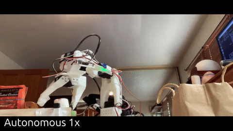
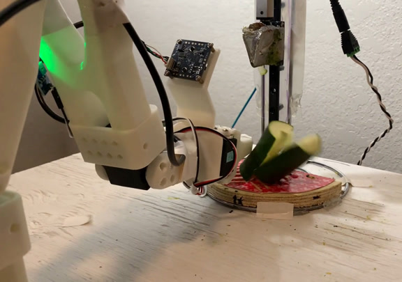
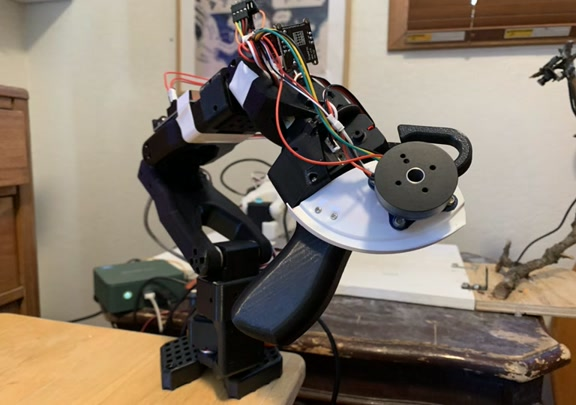
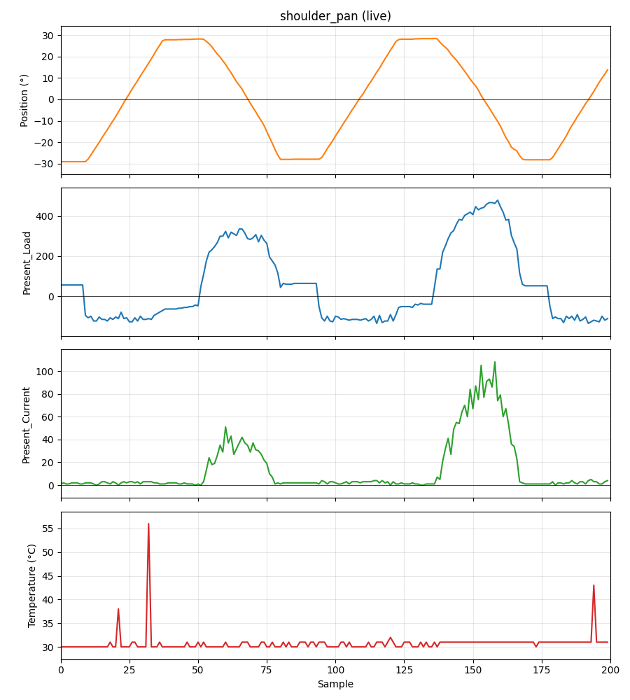

# LeRobot & the SO-101

## ✨ What's New

- **[Haptic Feedback Mod](https://github.com/ayerone/lerobot-haptic-feedback)** — feel the robot's gripping force through the teleoperator in real time

## What is the SO-101?

The SO-101 is an affordable, open-source robot arm and the standard hardware platform for the [Hugging Face LeRobot](https://huggingface.co/docs/lerobot/index) ecosystem. LeRobot provides tools and pretrained models that make it straightforward to apply cutting edge robotics techniques like imitation learning and reinforcement learning to a physical robot you can build at home.

## Getting Started

The typical workflow is:
1. **Collect data** — teleoperate the arm to demonstrate a task
2. **Train a policy** — use LeRobot to train a model on your demonstrations
3. **Run it** — deploy the policy and watch the arm perform the task autonomously

[Here's my video covering these topics](https://youtu.be/PoYpTzXzObo)

## My Experiments

### Modified Embodiments

LeRobot is "hardware agnostic" (it can be used with any robot, not just the SO-101). A natural first step toward general custom embodiments is modifying the SO-101 by adding a motor.

#### Log Splitter

First up: adding a linear actuator and building a scale model log splitter to perform autonomous log splitting on a desktop scale.

[See the log splitter on YouTube](https://youtu.be/pou4PEhgJao)

[Check out the log splitter on GitHub](https://github.com/ayerone/lerobot-logsplitter)

#### Haptic Feedback Mod

[lerobot_haptic_feedback](https://github.com/ayerone/lerobot-haptic-feedback) — Feedback teleoperation

### Safety Measures

[lerobot-guardian-angle](https://github.com/ayerone/lerobot-guardian-angle) — Monitoring and safeguarding the SO-101's motors during operation

